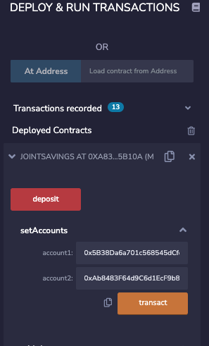

# Solidity-Smart-Contracts


Solidity Smart Cortracts that allow joint user's the ability to deposit into a saving's account and withdraw, Trustlessly. This Smart Contract called JointSavings could be deployed onto the Ethereum Blockchain and it would be Immutable. Some functionality in the JointSavings smart contract includes :

- Deposit

- Withdraw

- Check account balance

- Check who was the last to withdraw

- What was the last withdraw amount


## Technologies & Installation

This smart contract was written in Solidity and I used the Remix IDE. There are no installations required to run and interact with the smart contract.


## Usage

This smart contract is written in Solidity and I used the Remix IDE to compile and test functionalities. If the user want to interact with the smart contract it is possible to clone this repository into a local folder and launch the remix IDE here: [Remix](https://remix.ethereum.org/#optimize=false&runs=200&evmVersion=null&version=soljson-v0.8.7+commit.e28d00a7.js) and then select Solidity as the Environment. Then you can upload the ``` joint_savings.sol ``` file. It will be necessary to compile and deploy before interacting with the smart contract. 


## Contributors

Stephen Thomas @ stephenthomas43@gmail.com

[Trilogy Education Services](https://www.trilogyed.com/)

[UC Berkeley Extension ](https://extension.berkeley.edu/)


## License 

MIT


# Preview of Smart Contract Funtionality
---

## Deposit Funcionality / 1 ETH in Wei


- Here you can see JointSavings contract and its deposit function has allowed a 1 eth in wei deposit to the contract. Note the ``` contractBalance ``` shows 1 eth in wei. Also note the transaction details show 1 eth in wei as the value of the transaction. 

## Deposit Functionality / 10 ETH in Wei


- Here you can see the JointSavings contract and its deposit funtion has allowed a 10 eth in wei deposit to the contract. Note the transaction details show the value as 10 eth in wei. Also note the ``` contractBalance ``` has increased from 1 eth in wei to 11 eth in wei.

## Deposit Functionality / 5 ETH 


- Here you can see the JointSavings contract and its deposit funtion has allowed a 5 eth deposit to the contract. Note the transaction details show the value as 5 eth in wei. Also note the ``` contractBalance ``` has increased from 11 eth in wei to 16 eth in wei.

## Withdrawal Functionality / 5 ETH withdrawal to Account 1


- Here you can see JointSavings contract and its withdrawal funtion has allowed a 5 eth withdrawal from the contract address to Account 1. Note the ``` contractBalance ``` has adjusted from 16 eth in wei to 11 eth in wei. Also note that the ``` lastToWithdraw ``` shows Account1 ``` ox5B38...ddC4 ``` as the last to withdraw.

## Withdrawal Functionality / 10 ETH withdrawal to Account 2


- Here you can see JointSavings contract and its withdrawal funtion has allowed a 10 eth withdrawal from the contract address to Account 2. Note the ``` contractBalance ``` has adjusted from 11 eth in wei to 1 eth in wei. Also note that the ``` lastToWithdraw ``` shows Account1 ``` oxAb84...5cb2 ``` as the last to withdraw.
- 
## Set Accounts Functionality


- Here you can see the ``` setAccounts ``` function with its inputs. Note Account 1 as ``` ox5B38...ddC4 ``` & Account 2 as ``` oxAb84...5cb2 ```. This funtion allows for the user to input any two valid address's making the smart contract ``` JointSavings ``` and the functions included customizable for any two individuals or entity's.
